# Диаграмма контейнеров C4 — Целевая архитектура «Будущее 2.0»

## Описание

Целевая архитектура через 1 год предполагает переход от монолитного DWH к доменно-ориентированной архитектуре в облаке с порталом самообслуживания, событийной интеграцией и независимым развитием бизнес-направлений. Функции текущей ESB при этом не "переезжают целиком в Kafka", а декомпозируются между доменными сервисами, интеграционными адаптерами, контрактами событий и платформой данных.

## Диаграмма контейнеров (C4 Level 2)

```mermaid
C4Container
    title Целевая архитектура «Будущее 2.0» — Диаграмма контейнеров

    Person(operator, "Оператор клиники", "Работает с пациентами, вводит данные")
    Person(analyst, "Бизнес-аналитик", "Строит отчёты, анализирует данные")
    Person(manager, "Руководитель", "Принимает управленческие решения")
    Person(fintech_client, "Клиент финтех", "Использует финансовые сервисы")

    Container_Boundary(cloud, "Облачная инфраструктура (Yandex Cloud)") {

        Container(portal, "Портал самообслуживания", "React, TypeScript", "Витрина данных, конструктор отчётов, дашборды")
        Container(api_gw, "API Gateway", "Kong", "Маршрутизация, rate limiting, авторизация")
        Container(iam, "IAM / SSO", "Keycloak", "Аутентификация, RBAC, управление доступом")

        Container_Boundary(clinic, "Домен: Клиники") {
            Container(clinic_ui, "Веб-интерфейс оператора", "React", "Замена PowerBuilder, работа с пациентами")
            Container(clinic_api, "Clinic API", "Java/Kotlin, Spring Boot", "Управление пациентами, расписание, инвентаризация, ФЛК и бизнес-правила домена")
            ContainerDb(clinic_db, "Clinic DB", "PostgreSQL", "Данные пациентов, персонал, инвентарь")
        }

        Container_Boundary(fintech, "Домен: Финтех") {
            Container(fintech_api, "Финтех-сервисы", "Golang, Java", "Кредиты, счета, платежи, скоринг, ФЛК финансовых операций")
            ContainerDb(fintech_db, "FinTech DB", "PostgreSQL", "Финансовые данные, транзакции")
        }

        Container_Boundary(ai, "Домен: ИИ-сервисы") {
            Container(ai_api, "AI Services", "Python, FastAPI", "ML-модели, диагностика, анализ снимков")
            ContainerDb(ai_store, "AI Feature Store", "S3 + ClickHouse", "Обучающие данные, признаки, результаты")
        }

        Container_Boundary(data_platform, "Платформа данных") {
            Container(kafka, "Event Streaming", "Apache Kafka", "Событийная шина, интеграция доменов")
            Container(contracts, "Контракты событий", "Avro/Protobuf", "Схемы событий, совместимость версий, техническая валидация")
            Container(adapters, "Интеграционные адаптеры", "Kafka Connect / consumer services", "Трансформация форматов, bridge с legacy и внешними системами, retry/DLQ")
            Container(etl, "ETL/ELT Pipelines", "Apache Airflow + dbt", "Оркестрация и аналитические трансформации данных")
            ContainerDb(datalake, "Data Lake", "S3 Object Storage", "Сырые данные всех доменов")
            ContainerDb(analytics_db, "Analytical Store", "ClickHouse", "Аналитическое хранилище, быстрые запросы")
            Container(bi, "BI Engine", "Apache Superset", "Визуализация, дашборды, ad-hoc запросы")
        }

        Container_Boundary(legacy, "Легаси (переходный период)") {
            ContainerDb(dwh_old, "Legacy DWH", "SQL Server 2008", "Исторические данные, поэтапная миграция")
            Container(esb_old, "Legacy ESB", "Apache Camel", "Поддержка существующих интеграций")
        }
    }

    Rel(operator, clinic_ui, "Работает", "HTTPS")
    Rel(analyst, portal, "Строит отчёты", "HTTPS")
    Rel(manager, portal, "Смотрит дашборды", "HTTPS")
    Rel(fintech_client, api_gw, "Финансовые операции", "HTTPS")

    Rel(portal, api_gw, "Запросы", "HTTPS")
    Rel(clinic_ui, api_gw, "Запросы", "HTTPS")
    Rel(api_gw, iam, "Аутентификация", "OAuth2/OIDC")

    Rel(api_gw, clinic_api, "REST API", "HTTPS")
    Rel(api_gw, fintech_api, "REST API", "HTTPS")
    Rel(api_gw, ai_api, "REST API", "HTTPS")
    Rel(api_gw, bi, "Запросы отчётов", "HTTPS")

    Rel(clinic_api, clinic_db, "CRUD", "SQL")
    Rel(fintech_api, fintech_db, "CRUD", "SQL")
    Rel(ai_api, ai_store, "Чтение/запись", "S3 API + SQL")
    Rel(clinic_api, contracts, "Публикует/читает схемы событий", "Avro/Protobuf")
    Rel(fintech_api, contracts, "Публикует/читает схемы событий", "Avro/Protobuf")
    Rel(ai_api, contracts, "Публикует/читает схемы событий", "Avro/Protobuf")

    Rel(clinic_api, kafka, "Публикует события", "Kafka Protocol")
    Rel(fintech_api, kafka, "Публикует события", "Kafka Protocol")
    Rel(ai_api, kafka, "Подписка на события", "Kafka Protocol")

    Rel(adapters, kafka, "Читает/публикует события", "Kafka Protocol")
    Rel(kafka, etl, "Потоковые данные", "Kafka Protocol")
    Rel(etl, datalake, "Сырые данные", "S3 API")
    Rel(etl, analytics_db, "Агрегированные данные", "SQL")
    Rel(bi, analytics_db, "Запросы", "SQL")
    Rel(portal, bi, "Встроенные дашборды", "HTTPS/iframe")

    Rel(dwh_old, etl, "Миграция данных", "JDBC")
    Rel(esb_old, adapters, "Временный bridge legacy-интеграций", "HTTP/JMS/JDBC")

    UpdateLayoutConfig($c4ShapeInRow="3", $c4BoundaryInRow="2")
```

## Как в целевой архитектуре заменяется ESB

В текущем ландшафте Apache Camel совмещает транспорт, маршрутизацию, ФЛК и преобразование сообщений. В целевой архитектуре эти обязанности разделяются:

| Обязанность ESB | Новый владелец ответственности |
|---|---|
| Доставка и fan-out сообщений | **Kafka** |
| Техническая валидация формата сообщений | **Контракты событий (Avro/Protobuf)** |
| Форматно-логический контроль предметной области | **Доменные API и сервисы** |
| Преобразование форматов для legacy и внешних партнёров | **Интеграционные адаптеры** |
| Агрегации и подготовка аналитических витрин | **ETL/ELT-платформа** |
| Синхронные интеграции по запросу | **API Gateway + REST API** |

Таким образом, Kafka используется как "тонкая" событийная шина, а не как новый монолитный центр интеграций. Это снижает связанность систем и убирает общую точку, в которой раньше концентрировались изменения всех доменов.

## Как целевая архитектура поддерживает ключевые бизнес-сценарии

| Бизнес-сценарий | Поддержка в целевой архитектуре |
|---|---|
| **Быстрая подготовка отчётности** | Аналитическое хранилище ClickHouse обеспечивает выполнение запросов за секунды вместо часов. Портал самообслуживания позволяет аналитикам строить отчёты без привлечения IT. |
| **Независимое развитие финтех-направления** | Выделенный домен с собственной БД и сервисами. Бизнес-правила и ФЛК остаются внутри финтех-сервисов, а обмен снаружи идёт через события и контрактные схемы. |
| **Независимое развитие ИИ-направления** | Отдельный домен ИИ с собственным хранилищем. Получает данные через событийную шину и адаптеры, не зависит от DWH и не требует изменений в общей ESB. |
| **Масштабирование для новых бизнесов** | Новый бизнес (фармацевтика, электроника) подключается как отдельный домен: своя БД, свои сервисы, свои события. Если нужен обмен с legacy или внешним контрагентом, добавляется локальный интеграционный адаптер, а не меняется центральная шина. |
| **Обеспечение безопасности** | IAM/SSO с RBAC — разграничение доступа по ролям и доменам. Медицинские карты и истории болезней остаются изолированными в домене клиник. |
| **Миграция в облако** | Вся целевая инфраструктура развёрнута в Yandex Cloud с IaC (Terraform). Масштабирование ресурсов по требованию. |
| **Снижение зависимости от DWH** | DWH сохраняется временно для исторических данных. Вся новая логика реализуется в доменных сервисах, адаптерах и платформе данных. Данные мигрируются поэтапно. |
